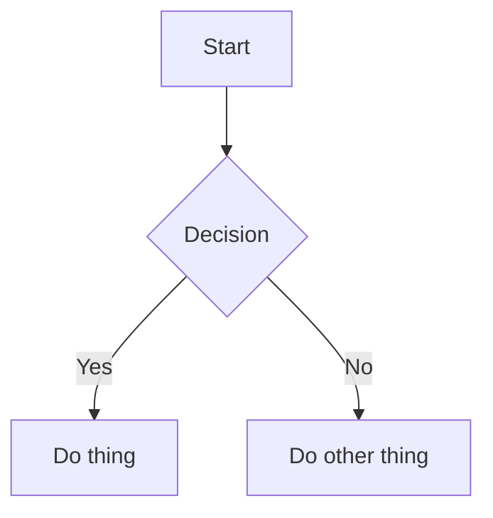
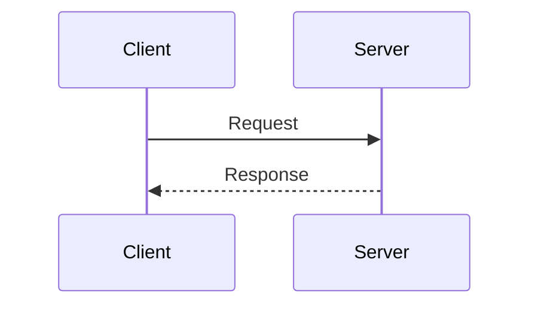

# MkDocs + shadcn Theme: Setup Playbook

How to set up a documentation site using MkDocs with the shadcn theme, based on the netglance project. This is a practical, copy-paste guide for reproducing the pattern on a new project.

---

## 1. Initial setup

### Install dependencies

The shadcn theme for MkDocs is distributed as `mkdocs-shadcn`. You need MkDocs 1.x (not 2.x) alongside it.

Add a `docs` dependency group to your `pyproject.toml`:

```toml
[dependency-groups]
docs = [
    "mkdocs>=1.6,<2",
    "mkdocs-shadcn>=0.9",
]
```

This keeps doc dependencies separate from your main project deps and dev deps. Install them with:

```bash
uv sync --group docs
```

Or if you prefer pip:

```bash
pip install "mkdocs>=1.6,<2" mkdocs-shadcn
```

### Directory structure

Create this layout in your project root:

```
myproject/
  docs/
    index.md              # home/landing page
    css/
      custom.css          # custom component styles
    js/
      mermaid-init.js     # mermaid diagram support (optional)
    assets/
      logo.svg            # your project logo
    guide/                # conceptual/tutorial content
      index.md
    reference/            # technical reference content
      index.md
  overrides/              # theme template overrides
    main.html
  mkdocs.yml              # main config file
  pyproject.toml
```

### Verify the setup

```bash
# Local dev server with hot reload
uv run --group docs mkdocs serve

# Build static site (outputs to site/)
uv run --group docs mkdocs build --strict
```

The `--strict` flag turns warnings into errors, which is useful for catching broken links and missing pages before deployment.

---

## 2. mkdocs.yml anatomy

Here is a complete annotated config. Each section is explained below.

```yaml
# ── Site metadata ────────────────────────────────────────
site_name: My Project
site_url: https://username.github.io/my-project/
site_description: One-line description of your project
repo_url: https://github.com/username/my-project
repo_name: username/my-project

docs_dir: docs

# ── Theme ────────────────────────────────────────────────
theme:
  name: shadcn
  custom_dir: overrides        # template overrides (see section 6)
  topbar_sections: true        # top nav tabs per top-level nav section
  icon: assets/logo.svg
  logo: assets/logo.svg
  favicon: assets/logo.svg

# ── Plugins ──────────────────────────────────────────────
plugins:
  - search                     # built-in search

# ── Markdown extensions ──────────────────────────────────
markdown_extensions:
  - admonition                 # note/warning/tip callout boxes
  - attr_list                  # add CSS classes to elements
  - md_in_html                 # markdown inside HTML blocks
  - toc:
      permalink: true          # anchor links on headings
  - pymdownx.highlight:
      anchor_linenums: true    # line numbers in code blocks
  - pymdownx.superfences:      # fenced code blocks + mermaid
      custom_fences:
        - name: mermaid
          class: mermaid
          format: !!python/name:pymdownx.superfences.fence_code_format
  - pymdownx.tabbed:           # tabbed content blocks
      alternate_style: true
  - pymdownx.details           # collapsible sections (<details>)

# ── Extra assets ─────────────────────────────────────────
extra_css:
  - css/custom.css

extra_javascript:
  - js/mermaid-init.js

# ── Navigation ───────────────────────────────────────────
nav:
  - Home: index.md
  - Guides:
      - Guides: guide/index.md
      - Getting Started:
          - guide/getting-started.md
      - Concepts:
          - guide/concepts/topic-a.md
          - guide/concepts/topic-b.md
  - Docs:
      - Documentation: reference/index.md
      - Commands:
          - reference/commands/foo.md
          - reference/commands/bar.md
```

### Key config choices explained

**`topbar_sections: true`** -- This is critical. When enabled, each top-level nav item (Home, Guides, Docs) becomes a tab in the top navigation bar. The sidebar then shows only the children of whichever top-level section you are in, instead of the entire nav tree. This makes navigation manageable for large sites.

**`custom_dir: overrides`** -- Tells MkDocs to look in `overrides/` for template files that replace or extend the theme's built-in templates. See section 6.

**`pymdownx.superfences` with `custom_fences`** -- The `mermaid` fence definition tells superfences to output mermaid code blocks as `<pre class="mermaid">` instead of treating them as regular code. The JS init script (section 7) then picks these up and renders them as diagrams.

**`pymdownx.tabbed` with `alternate_style: true`** -- The alternate style uses radio buttons under the hood instead of JavaScript tabs. This is important because shadcn's base CSS hides the default tabbed content style, so you need custom CSS overrides (section 5) to make tabs visible.

---

## 3. Home/landing pages vs doc pages

The key distinction in this setup: **landing pages** use raw HTML with custom CSS components for visual impact, while **content pages** use standard markdown.

### Landing page pattern (index.md)

Landing pages hide the sidebar and TOC via frontmatter, then use HTML card grids and visual elements:

```markdown
---
hide:
  - navigation
  - toc
---

# My Project

**Tagline goes here.**

A paragraph of description.

---

## Features

<div class="card-grid">
<a class="card" href="guide/getting-started/">
<p class="card-title">Getting Started</p>
<p class="card-desc">Get up and running in 5 minutes.</p>
</a>
<a class="card" href="reference/commands/foo/">
<p class="card-title">Command Reference</p>
<p class="card-desc">Full docs for every command.</p>
</a>
<a class="card card-soon" href="#">
<p class="card-title">Something Planned <span class="card-pill">Coming soon</span></p>
<p class="card-desc">This feature is in development.</p>
</a>
</div>
```

The `hide: [navigation, toc]` frontmatter is read by the `main.html` override template, which switches to a full-width layout (no sidebar grid) when those flags are set. This gives landing pages a clean, centered feel.

### Content page pattern

Content pages are standard markdown with no special frontmatter. They get the sidebar, TOC, and prev/next navigation automatically:

```markdown
# DNS Health

> Short description of what this page covers.

## What it does

Standard markdown content here. Code blocks, tables, lists, admonitions.

## Quick start

\```bash
mycommand do-thing
\```

## Commands

### `mycommand subcommand`

Description and usage.
```

The leading blockquote (`> Short description...`) serves as a subtitle. It is a convention, not a theme feature -- it just looks good under an H1 with the shadcn typography defaults.

### Section landing pages (guide/index.md, reference/index.md)

Section landing pages sit between the home page and content pages. They keep the sidebar visible (no `hide` frontmatter) but use HTML card grids and curated link lists to provide navigation within the section:

```markdown
# Guides

Introductory paragraph about what this section covers.

---

## Start here

**[First Topic](practical/first-topic.md)** -- Description of what this covers.

**[Second Topic](practical/second-topic.md)** -- Description of what this covers.

---

## Understand the concepts

- [Concept A](concepts/concept-a.md) -- One-line explanation
- [Concept B](concepts/concept-b.md) -- One-line explanation
```

The pattern: bold linked titles with em-dash descriptions for primary content, bullet lists for secondary content.

---

## 4. Guides vs reference docs

The separation between "Guides" and "Docs" (reference) is both structural and tonal.

### Guides (conceptual, task-oriented)

- **URL structure:** `guide/practical/task-name.md`, `guide/concepts/topic-name.md`
- **Tone:** Conversational, explains *why* things matter, assumes no prior knowledge
- **Content:** Mermaid diagrams, step-by-step walkthroughs, real-world examples
- **Organized by:** User questions ("What's on my network?") and conceptual topics
- **Audience:** Someone who wants to understand

Example nav structure:

```yaml
- Guides:
    - Guides: guide/index.md
    - Practical Guides:
        - "What's on My Network?": guide/practical/whats-on-my-network.md
        - "Is My Internet Slow?": guide/practical/is-my-internet-slow.md
    - Concepts:
        - Basics:
            - guide/concepts/how-networks-work.md
            - guide/concepts/arp-and-mac-addresses.md
        - Security & Privacy:
            - guide/concepts/tls-and-certificates.md
            - guide/concepts/wifi-security.md
```

Practical guides use question-style titles in quotes. Concept pages use descriptive titles. Nesting under sub-headings (Basics, Security & Privacy) creates collapsible sidebar sections.

### Reference docs (technical, command-oriented)

- **URL structure:** `reference/tools/command-name.md`, `reference/deployment/platform.md`
- **Tone:** Concise, technical, focused on *how* to use specific features
- **Content:** Command syntax, option tables, examples, output samples
- **Organized by:** Functional category (Discovery, Security, Monitoring)
- **Audience:** Someone who wants to do a specific thing

Example nav structure:

```yaml
- Docs:
    - Documentation: reference/index.md
    - Getting Started: reference/getting-started.md
    - Discovery & Inventory:
        - reference/tools/discover.md
        - reference/tools/scan.md
    - Security:
        - reference/tools/dns.md
        - reference/tools/tls.md
    - Deployment:
        - reference/deployment/raspberry-pi.md
        - reference/deployment/docker.md
```

Reference pages follow a consistent structure: What it does, Quick start, Commands (with subheadings per subcommand), options tables, and examples.

### Why this split matters

With `topbar_sections: true`, clicking "Guides" or "Docs" in the top bar switches the sidebar entirely. A user browsing concepts never sees the command reference cluttering their sidebar, and vice versa. Each section feels like its own focused site.

---

## 5. Custom components

The shadcn theme provides beautiful defaults, but you need custom CSS for components that MkDocs markdown extensions generate. Create `docs/css/custom.css` and reference it in `mkdocs.yml` as shown in section 2.

### Card grids

Responsive grids of clickable cards. Used on landing pages and section indexes.

```css
/* ── Card grid ────────────────────────────────────────── */
.card-grid {
  display: grid;
  grid-template-columns: repeat(1, 1fr);
  gap: 1rem;
  margin: 1.5rem 0;
}

@media (min-width: 640px) {
  .card-grid { grid-template-columns: repeat(2, 1fr); }
}

@media (min-width: 1024px) {
  .card-grid { grid-template-columns: repeat(3, 1fr); }
}

.card-grid a.card {
  display: flex;
  flex-direction: column;
  gap: 0.25rem;
  padding: 1.25rem;
  border: 1px solid var(--border);
  border-radius: 0.5rem;
  background: var(--card);
  color: var(--card-foreground);
  text-decoration: none;
  transition: border-color 0.15s, box-shadow 0.15s;
}

.card-grid a.card:hover {
  border-color: var(--primary);
  box-shadow: 0 1px 4px oklch(0% 0 0 / 0.06);
}

.card-grid a.card .card-title {
  font-weight: 600;
  font-size: 1rem;
  margin: 0;
}

.card-grid a.card .card-desc {
  font-size: 0.875rem;
  color: var(--muted-foreground);
  margin: 0;
  line-height: 1.45;
}
```

Usage in markdown (requires `md_in_html` and `attr_list` extensions):

```html
<div class="card-grid">
<a class="card" href="path/to/page/">
<p class="card-title">Card Title</p>
<p class="card-desc">Short description of what this links to.</p>
</a>
<a class="card" href="path/to/page/">
<p class="card-title">Another Card</p>
<p class="card-desc">Another description.</p>
</a>
</div>
```

### "Coming soon" cards and pills

Dimmed, dashed-border cards for features that are planned but not yet available:

```css
.card-grid a.card.card-soon {
  opacity: 0.55;
  border-style: dashed;
  cursor: default;
}

.card-grid a.card.card-soon:hover {
  border-color: var(--border);
  box-shadow: none;
}

.card-grid .card-pill {
  display: inline-block;
  font-size: 0.7rem;
  font-weight: 600;
  letter-spacing: 0.02em;
  padding: 0.15em 0.5em;
  border-radius: 9999px;
  border: 1px solid var(--border);
  color: var(--muted-foreground);
  margin-left: 0.5em;
  vertical-align: middle;
}
```

Usage:

```html
<a class="card card-soon" href="#">
<p class="card-title">Future Feature <span class="card-pill">Coming soon</span></p>
<p class="card-desc">Description of what's planned.</p>
</a>
```

### Tabbed content

The `pymdownx.tabbed` extension generates tab markup, but the shadcn theme's `base.css` hides the tabbed content by default. You need overrides to make tabs work:

```css
/* pymdownx.tabbed - alternate style */
.tabbed-set {
  position: relative;
  display: flex;
  flex-wrap: wrap;
  margin: 1em 0;
  border-radius: 0.375rem;
}

.tabbed-set > input {
  display: none;
}

.tabbed-labels {
  display: flex;
  width: 100%;
  overflow: auto;
  scrollbar-width: none;
  border-bottom: 1px solid hsl(var(--border));
}

.tabbed-labels > label {
  font-size: 0.85rem;
  font-weight: 500;
  padding: 0.5em 1.25em;
  cursor: pointer;
  color: hsl(var(--muted-foreground));
  border-bottom: 2px solid transparent;
  transition: color 0.2s, border-color 0.2s;
  white-space: nowrap;
  user-select: none;
}

.tabbed-labels > label:hover {
  color: hsl(var(--foreground));
}

/* Active tab label */
.tabbed-set > input:nth-child(1):checked ~ .tabbed-labels > label:nth-child(1),
.tabbed-set > input:nth-child(2):checked ~ .tabbed-labels > label:nth-child(2),
.tabbed-set > input:nth-child(3):checked ~ .tabbed-labels > label:nth-child(3),
.tabbed-set > input:nth-child(4):checked ~ .tabbed-labels > label:nth-child(4) {
  color: hsl(var(--foreground));
  border-bottom-color: hsl(var(--primary));
}

/* Override shadcn base.css hiding tabbed content */
article .tabbed-set div.tabbed-content {
  display: block !important;
  width: 100%;
}

article .tabbed-set div.tabbed-content > .tabbed-block {
  display: none;
  padding: 0.75em 0;
}

/* Show active tab content */
.tabbed-set > input:nth-child(1):checked ~ .tabbed-content > .tabbed-block:nth-child(1),
.tabbed-set > input:nth-child(2):checked ~ .tabbed-content > .tabbed-block:nth-child(2),
.tabbed-set > input:nth-child(3):checked ~ .tabbed-content > .tabbed-block:nth-child(3),
.tabbed-set > input:nth-child(4):checked ~ .tabbed-content > .tabbed-block:nth-child(4) {
  display: block !important;
}
```

Usage in markdown:

```markdown
=== "uv (recommended)"

    \```bash
    uv tool install myproject
    \```

=== "pip"

    \```bash
    pip install myproject
    \```
```

Note: The content under each tab label must be indented by 4 spaces. If you have more than 4 tabs, extend the `nth-child` selectors accordingly.

### Sidebar chevrons

The custom sidebar template (section 6) uses collapsible `<details>` elements. These CSS rules animate the chevron icons:

```css
.sidebar-chevron {
  transition: transform 0.2s ease;
}

details.sidebar-section[open] > summary .sidebar-chevron {
  transform: rotate(90deg);
}

details.sidebar-section > ul {
  margin-left: 0.75rem;
  padding-left: 1rem;
  border-left: 1px solid hsl(var(--border));
  margin-top: 0.125rem;
  margin-bottom: 0.25rem;
}
```

### Admonitions

Admonitions work out of the box with the `admonition` extension. No custom CSS needed. Usage:

```markdown
!!! tip "Pro tip"
    Content inside the admonition box.

!!! warning
    This is a warning without a custom title.

!!! note "Important"
    Notes are styled differently from warnings and tips.
```

### CSS variable reference

The shadcn theme exposes CSS custom properties that you should use in your custom styles so they respect light/dark mode automatically:

| Variable | Purpose |
|----------|---------|
| `--border` | Border color |
| `--card` | Card background |
| `--card-foreground` | Card text color |
| `--primary` | Primary accent color |
| `--foreground` | Main text color |
| `--muted-foreground` | Secondary/dimmed text |
| `--background` | Page background |

Use `var(--border)` in most places. Some theme CSS uses `hsl(var(--border))` -- check which format the variable uses in your version. If a color does not render, try wrapping or unwrapping the `hsl()` call.

---

## 6. Theme overrides

The `custom_dir: overrides` setting in `mkdocs.yml` lets you replace any template file from the shadcn theme. Files you place in `overrides/` take precedence over the theme's built-in templates with the same path.

### When you need overrides

The shadcn theme is relatively new and may not handle all MkDocs features perfectly. Common reasons to override templates:

1. **Full-width landing pages** -- The default layout always renders a sidebar. You need a modified `main.html` that reads frontmatter `hide` flags and conditionally removes the sidebar grid.
2. **Sidebar collapsibility** -- The default sidebar may render flat. A custom `sidebar.html` can use `<details>/<summary>` for collapsible section groups.

### main.html override

The main template handles the page shell. The critical addition is reading `hide` frontmatter flags and switching between a sidebar layout and a full-width layout.

Create `overrides/main.html`. The key structural logic:

```html
{# Resolve hide flags from page frontmatter #}



<body>
  <div>
    
    <main>
      <div>
        
        {# Full-width layout: no sidebar grid #}
        <div class="flex w-full ...">
          <div>
            
            
          </div>
          
            
          
        </div>
        
        {# Standard layout: sidebar + content + optional TOC #}
        <div class="lg:grid lg:grid-cols-[var(--sidebar-width)_minmax(0,1fr)] ...">
          <div data-slot="sidebar">
            
          </div>
          <div>
            
            
          </div>
          
            
          
        </div>
        
      </div>
    </main>
    
  </div>
</body>
```

This is simplified. The full template includes all the Tailwind utility classes for spacing, sticky positioning, overflow handling, and responsive breakpoints. Start by copying the theme's own `main.html` (find it with `python -c "import shadcn; print(shadcn.__file__)"` and looking in the package's `templates/` directory), then add the frontmatter conditionals around the sidebar grid.

### sidebar.html override

Create `overrides/templates/sidebar.html` for collapsible sidebar sections with chevron icons:

```html
<div data-slot="sidebar-group" class="relative flex w-full min-w-0 flex-col p-2">
    

    
    
    
    
    

    
    
    

    
    
    
    
    
    
    
    <li data-slot="sidebar-menu-item" class="relative">
        <details class="sidebar-section"
                  open>
            <summary class="flex cursor-pointer list-none items-center gap-2 ...">
                <svg xmlns="http://www.w3.org/2000/svg" width="14" height="14"
                     viewBox="0 0 24 24" fill="none" stroke="currentColor"
                     stroke-width="2" class="sidebar-chevron shrink-0">
                    <path d="m9 18 6-6-6-6"/>
                </svg>
                {{ section.title }}
            </summary>
            <ul class="flex w-full min-w-0 flex-col gap-0.5">
                {{ render_items(section.children) }}
            </ul>
        </details>
    </li>
    
    

    <div class="w-full text-sm">
        <ul class="flex w-full min-w-0 flex-col gap-0.5">
            {{ render_items(current, top_level=true) }}
        </ul>
    </div>

    
</div>
```

Key details:
- `nav|active_section|attr('children')` gets the children of whichever top-level section is active (only with `topbar_sections: true`)
- `section.active` is true when the current page is inside that section, so it auto-expands
- `top_level=true` opens all top-level sections by default
- The `sidebar-chevron` class ties into the CSS from section 5
- `` renders individual page links -- this comes from the theme, you do not need to override it

### Finding the original templates

To see what templates you can override:

```bash
python -c "import shadcn; import os; print(os.path.dirname(shadcn.__file__))"
```

Then browse that directory. Common files:
- `templates/main.html` -- page shell
- `templates/sidebar.html` -- sidebar
- `templates/header.html` -- top bar
- `templates/footer.html` -- footer
- `templates/page.html` -- article content area
- `templates/toc.html` -- table of contents
- `components/sidebar_item.html` -- individual sidebar link

---

## 7. Mermaid diagrams

Mermaid diagrams are rendered client-side. The setup has two parts: a superfences config in `mkdocs.yml` (already covered in section 2) and a JavaScript initialization file.

### JS init script

Create `docs/js/mermaid-init.js`:

```javascript
document.addEventListener("DOMContentLoaded", function () {
  // Convert pre.mermaid code blocks to div.mermaid for Mermaid.js
  document.querySelectorAll("pre.mermaid").forEach(function (pre) {
    var div = document.createElement("div");
    div.className = "mermaid";
    div.textContent = pre.textContent;
    pre.replaceWith(div);
  });

  if (document.querySelectorAll("div.mermaid").length === 0) return;

  var script = document.createElement("script");
  script.src = "https://cdn.jsdelivr.net/npm/mermaid@10/dist/mermaid.min.js";
  script.onload = function () {
    mermaid.initialize({ startOnLoad: false, theme: "default" });
    mermaid.run();
  };
  document.head.appendChild(script);
});
```

How it works:

1. `pymdownx.superfences` with the `mermaid` custom fence outputs `<pre class="mermaid">` blocks
2. The script converts these to `<div class="mermaid">` (what Mermaid.js expects)
3. Mermaid.js is loaded from CDN only if the page actually contains mermaid blocks (no wasted bandwidth)
4. `startOnLoad: false` + explicit `mermaid.run()` avoids race conditions

### Usage in markdown

````markdown



````

### Dark mode consideration

The init script uses `theme: "default"` which is the light theme. If you want dark mode support, you can detect the current theme and switch:

```javascript
var isDark = document.documentElement.classList.contains("dark");
mermaid.initialize({
  startOnLoad: false,
  theme: isDark ? "dark" : "default"
});
```

This depends on how the shadcn theme applies its dark class. Check the rendered HTML to find the right selector.

---

## 8. Deployment with GitHub Actions

### GitHub Pages setup

1. Go to your repo's Settings > Pages
2. Set Source to "GitHub Actions" (not "Deploy from a branch")
3. Add the workflow file below

### Workflow file

Create `.github/workflows/deploy-docs.yml`:

```yaml
name: Deploy docs

on:
  push:
    branches: [main]
    paths:
      - 'docs/**'
      - 'mkdocs.yml'
  workflow_dispatch:

permissions:
  contents: read
  pages: write
  id-token: write

concurrency:
  group: pages
  cancel-in-progress: false

jobs:
  build:
    runs-on: ubuntu-latest
    steps:
      - uses: actions/checkout@v4
      - uses: actions/setup-python@v5
        with:
          python-version: '3.12'
      - run: pip install "mkdocs>=1.6,<2" mkdocs-shadcn
      - run: mkdocs build --strict
      - uses: actions/upload-pages-artifact@v3
        with:
          path: site

  deploy:
    needs: build
    runs-on: ubuntu-latest
    environment:
      name: github-pages
      url: ${{ steps.deployment.outputs.page_url }}
    steps:
      - id: deployment
        uses: actions/deploy-pages@v4
```

### What this does

- **Triggers:** On push to `main` when docs or config change, or manually via workflow_dispatch
- **Path filter:** Only runs when `docs/**` or `mkdocs.yml` changes, not on every commit
- **Build step:** Installs MkDocs + shadcn (no need for your full project deps), builds with `--strict`
- **Deploy step:** Uses the official GitHub Pages deployment action with OIDC token auth

### `cancel-in-progress: false`

This is set to `false` (not `true`) intentionally. If you push docs twice in quick succession, you want the second build to queue and deploy after the first finishes, not cancel the first deployment mid-way. A cancelled deployment can leave Pages in a broken state.

### Custom domain

If you use a custom domain, add a `CNAME` file in `docs/` containing your domain:

```
docs.myproject.dev
```

MkDocs will copy it to `site/CNAME` during build, and GitHub Pages will pick it up.

---

## 9. Tips and gotchas

### The shadcn theme hides tabbed content by default

The theme's `base.css` contains `article .tabbed-set div.tabbed-content { display: none }`. Without the CSS overrides from section 5, tabs will render but their content panels will be invisible. This is the most common "why is my page blank" issue.

### Card grid HTML must not have blank lines between elements

MkDocs processes blank lines inside HTML blocks as paragraph breaks. This means:

```html
<!-- BAD: blank line between cards creates <p> tags -->
<div class="card-grid">

<a class="card" href="...">

<p class="card-title">Title</p>

</a>

</div>
```

The above will produce broken markup. Keep card elements tight with no blank lines between the opening `<div>` and the inner elements. A blank line before the opening `<div>` and after the closing `</div>` is fine.

### `md_in_html` extension is required for HTML blocks

Without the `md_in_html` extension, markdown inside `<div>` blocks will not be processed. If you ever mix markdown and HTML in the same block, you need this extension. The card grid pattern uses raw HTML so it does not strictly need it, but it is required for other patterns like putting markdown inside custom containers.

### href paths in cards must end with trailing slash or `.md`

MkDocs rewrites `.md` links to their built paths. Inside HTML blocks, `href="guide/getting-started/"` (trailing slash) works. `href="guide/getting-started"` (no trailing slash, no `.md`) may produce 404s depending on your web server config.

### The `overrides/` directory is not inside `docs/`

A common mistake is putting the `overrides/` directory inside `docs/`. It belongs at the project root, next to `mkdocs.yml`:

```
myproject/
  docs/           # content
  overrides/      # template overrides (NOT inside docs/)
  mkdocs.yml
```

### Tailwind classes do not work in custom CSS

The shadcn theme uses Tailwind internally, but the Tailwind classes are pre-compiled into the theme's `base.css`. Your custom CSS in `docs/css/custom.css` is plain CSS -- you cannot use Tailwind utility classes there. Use the theme's CSS custom properties (`var(--border)`, etc.) instead.

However, Tailwind classes do work in template overrides (`overrides/*.html`) because those are processed by the same template engine as the theme's built-in templates. The distinction: CSS files = plain CSS only, HTML templates = Tailwind classes OK.

### Logo and favicon paths are relative to `docs/`

The `icon`, `logo`, and `favicon` paths in `mkdocs.yml` are relative to the `docs/` directory:

```yaml
theme:
  icon: assets/logo.svg      # resolves to docs/assets/logo.svg
  logo: assets/logo.svg
  favicon: assets/logo.svg
```

### `--strict` catches problems early

Always build with `mkdocs build --strict` in CI. This catches:
- Broken internal links
- Missing pages referenced in `nav`
- Orphaned pages not in any nav section
- Template errors

### Adding pages to the nav

When you add a new markdown file, you must also add it to the `nav` section of `mkdocs.yml`. MkDocs will not auto-discover pages. If a page exists in `docs/` but is not in `nav`, it will be built but not accessible through navigation -- `--strict` will warn about this.

### Site URL matters for search and assets

Set `site_url` to your actual deployment URL (e.g., `https://username.github.io/my-project/`). The search plugin and some asset paths depend on this. If you omit it, search may not work correctly when deployed to a subdirectory.

### Local development command

```bash
uv run --group docs mkdocs serve
```

This starts a dev server at `http://127.0.0.1:8000` with live reload. Changes to markdown files, CSS, and config are picked up automatically. Changes to template overrides require a server restart.

### Version pinning strategy

Pin `mkdocs-shadcn` loosely (`>=0.9`) rather than exactly. The theme is actively developed and minor versions tend to add features without breaking changes. Pin `mkdocs` more tightly (`>=1.6,<2`) because MkDocs 2.x may break themes.

---

## 10. Dark mode

### How the theme handles dark mode

The shadcn theme includes a `dark.html` template (loaded in `<head>`) that already handles system preferences:

1. Checks `localStorage.theme` for a user override (`"dark"` or `"light"`)
2. Falls back to `prefers-color-scheme: dark` from the OS
3. Listens for live system changes via `matchMedia.onchange`

**No configuration needed** for basic dark mode -- it works out of the box.

### The theme toggle is two-state by default

The built-in toggle button in the header calls `onThemeSwitch()`, which flips between dark and light and writes to `localStorage`. Once toggled, there is no way to return to "auto" (system default). The function is defined with `const` in `callbacks.js`, so you **cannot** override it by reassigning `window.onThemeSwitch`.

To add a three-state cycle (light → dark → auto), create `docs/js/theme-toggle.js`:

```javascript
// Three-state theme toggle: light → dark → auto (system)
(function () {
  var icons = {
    light: '<svg ...>sun</svg>',    // Lucide sun icon
    dark: '<svg ...>moon</svg>',    // Lucide moon icon
    auto: '<svg ...>monitor</svg>'  // Lucide monitor icon
  };

  var titles = {
    light: "Theme: light",
    dark: "Theme: dark",
    auto: "Theme: auto"
  };

  var cycle = { light: "dark", dark: "auto", auto: "light" };

  function getState() {
    var s = localStorage.getItem("theme");
    return s === "dark" || s === "light" ? s : "auto";
  }

  function apply(state) {
    var root = document.documentElement;
    if (state === "dark") {
      root.classList.add("dark");
      localStorage.setItem("theme", "dark");
    } else if (state === "light") {
      root.classList.remove("dark");
      localStorage.setItem("theme", "light");
    } else {
      localStorage.removeItem("theme");
      if (window.matchMedia("(prefers-color-scheme: dark)").matches) {
        root.classList.add("dark");
      } else {
        root.classList.remove("dark");
      }
    }
    updateButton(state);
    if (typeof updatePygmentsStylesheet === "function") updatePygmentsStylesheet();
  }

  function updateButton(state) {
    var btn = document.querySelector('[title="Toggle theme"], [title^="Theme:"]');
    if (!btn) return;
    btn.title = titles[state];
    var span = btn.querySelector(".sr-only");
    var svg = btn.querySelector("svg");
    if (svg) svg.outerHTML = icons[state];
    if (span) span.textContent = titles[state];
  }

  // Replace the button's inline onclick — the theme's const cannot be overridden
  document.addEventListener("DOMContentLoaded", function () {
    var btn = document.querySelector('[title="Toggle theme"], [title^="Theme:"]');
    if (btn) {
      btn.removeAttribute("onclick");
      btn.addEventListener("click", function (e) {
        e.preventDefault();
        apply(cycle[getState()]);
      });
    }
    updateButton(getState());
  });
})();
```

**Critical gotcha:** The theme defines `onThemeSwitch` with `const` (not `var` or `function`). Top-level `const` lives in the global lexical environment, not on the `window` object. The inline `onclick="onThemeSwitch(event)"` resolves the lexical binding first, so `window.onThemeSwitch = ...` has no effect. You must strip the `onclick` attribute and attach your own listener.

Load it before other extra JS in `mkdocs.yml`:

```yaml
extra_javascript:
  - js/theme-toggle.js
  - js/mermaid-init.js
```

### Logo / icon dark mode

The shadcn theme renders the logo as an `` tag (see `components/icon.html`), so SVGs with `fill="currentColor"` will **not** inherit the text color -- `` elements don't participate in CSS color inheritance.

Two approaches:

**Approach A: CSS filter (single file, recommended)**

Keep one black SVG (`logo.svg`) and invert it in dark mode:

```css
.dark img[src*="logo"] {
  filter: invert(1);
}
```

This is clean for single-color logos. For multi-color logos, you would need approach B.

**Approach B: Two files with template override**

Keep `logo.svg` (black) and `logo-white.svg` (white). Override `components/icon.html` in `overrides/` to swap sources based on the `dark` class. More work but more control.

### Mermaid dark mode

The mermaid init script should detect the current theme:

```javascript
var isDark = document.documentElement.classList.contains("dark");
mermaid.initialize({
  startOnLoad: false,
  theme: isDark ? "dark" : "default"
});
```

Note: this only checks at init time. If the user toggles the theme after page load, mermaid diagrams won't re-render. This is acceptable for most use cases.

### Asset organization for dark mode

For a project with a single-color logo, keep assets minimal:

```
docs/assets/
  logo.svg           # black, used by docs site (CSS filter handles dark mode)
  logo-white.svg     # white, used by GitHub README <picture> element
```

GitHub's markdown renderer does not apply CSS, so the README needs a separate white SVG inside a `<picture>` element with `prefers-color-scheme` media queries. The docs site only needs the black version because CSS `filter: invert(1)` handles the rest.

Do not maintain separate `icon-dark.svg`, `networking-white.svg`, etc. -- this leads to duplication. Name files by what they are (`logo`), not what color they are.

---

## Quick-start checklist

For setting up a new project from scratch:

1. Add `mkdocs` and `mkdocs-shadcn` to your `pyproject.toml` docs group
2. Create `mkdocs.yml` with the config from section 2
3. Create `docs/index.md` as a landing page (with `hide: [navigation, toc]`)
4. Create `docs/css/custom.css` with card grid + tab styles from section 5
5. Create `docs/js/mermaid-init.js` from section 7 (if you want diagrams)
6. Create `overrides/main.html` based on the theme's default, adding frontmatter hide logic
7. Create `overrides/templates/sidebar.html` for collapsible sections
8. Add your content pages under `docs/guide/` and `docs/reference/`
9. Build the nav tree in `mkdocs.yml`
10. Add `.github/workflows/deploy-docs.yml` from section 8
11. Enable GitHub Pages with "GitHub Actions" source in repo settings
12. Run `uv run --group docs mkdocs serve` and iterate
